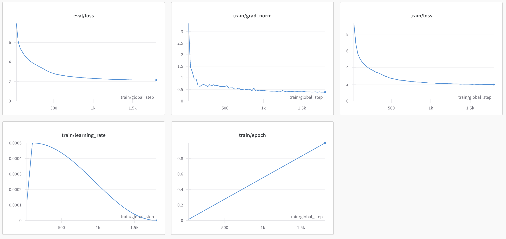

# Pretrained GPT2
This is a GPT2 model trained from scratch on [ArtifactAI/arxiv_python_research_code](https://huggingface.co/datasets/ArtifactAI/arxiv_python_research_code) dataset.

### Final Model
You can fine the model I finetuned and uploaded [here](https://huggingface.co/MadMarx37/python-gpt2).

### Hardware requirements
Since we have GPT2 which is FP32, we need 32 / 8 = 4 bytes per param.
The model has ~125M params, so the memory requirements are:
125000000 * 4 = 500000000 bytes ~= 465MB

### Quantization
The model is small enough to use on consumer harware without quantization, plus there isn't much room for losing performance.

### Training metrics

The training graphs suggest that our model might've gotten stuck in a local minima, since the gradient norms, validation loss, and training loss all plateaud. We could deal with this by trying different learning rates and LR schedulers. In the interest of time, I'm leaving that experiment for later.

## Using the model
Run `pip install -r requirements.txt` to install the required modules.

### Tuning your own model
If you want to tune your own model, you can run `python train.py`. The default number of samples from the above dataset used
to finetune the model is 50000, but you can provide your own number with `python train.py -n <number of samples>`

### Prediction
You can run prediction by running `python predict.py <prompt>`, which will run prediction using the model I trained.
If you want to use the model you trained instead, you can replace the `model_name` attribute in `predict.py` and proceed as above.