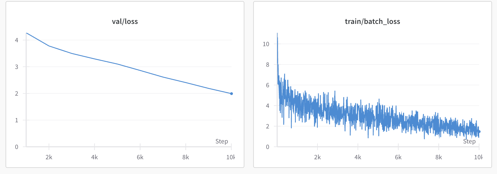

This is a transformer model trained from scratch and written in PyTorch.

### Results

The first run was quite naive (with no hyperparam optimization) and took ~20 minutes for 10 epochs.

### Evaluation
Prompt (same as the one for the GPT2 model):
```
# create some data
x = np.random.randn(100)
y = np.random.randn(100)

# create scatter plot with x, y
```

Response:
```
# create some data
x = np.random.randn(100)
y = np.random.randn(100)

# create scatter plot with x, y
Wedb_grid z
zad_max_ksampleAIN//+14 = ux_all(np Attention.fromarray cost_priorarna
sh75.shape, u//b)/box, SFR, Numpy_xy P
test, Obj, rep(Y,)
  *(b,(vecain](S_detfile, NBH, schedulegS z OUT[:, -ifhcurS_ABS'.flattenSphi.03
Z6
fc
surface -.compile
x07, -reshape
search
   while -b00 -bw - checked -S   -m, L140].
|x.K.e zS -S   -�.ip   -NS  gft -tNrulsNS   -264deriv - S ph_H43   zY   -╔(-xs96   -hz - heavily -styleparams -PX -v -�   -55 -cluster -:- - longitudere119
styleS   - Lou!-- -██URE.p   -fc   -td *=   -   {{.constants -Lo remote z AND BRals -pprowidth -55   -S   -\SCRIPT -NUM     character}},ableslo78 -M   -CityS   z   z -     Sa     -39 -   -uls   correlation mass -:\(profile calcul Telescopeparams -inalg - -all Debian templates_y   -751   - S   -m,   -   -79S   z Rrr - MK --port)+   -   -32     -   - Puls -S   z	d - struct -175 masses   -mass   -   -343， then  SELECT136 -pp  601   -   -   -ducedNorth     �  244 Larstram   -██_POWER   -     -widthES   -   - DM.face   VegahisRR -   -   -   - [- - -render   █████   -   -██║     -136b -       - kernel   -GNU     z -119   - program     -AX  she   -   -   -   -   -     -183X     primary   write -ech [-     ██   -   -*)          -Func   -   -   Companion   ██       -79-'+      entric   -   - -   - s   -   -   █████ QQ   '('   ██   -�   -   Check   -.home -   -  
```

As we can see, the current response is quite gibberish, and requires many more epochs of training

### Training your own.
You can train your own model by running `python train.py`, at which point you will get a model checkpoint called `trained_model`, which you can load using the `model.load_checkpoint` function in the provided model.